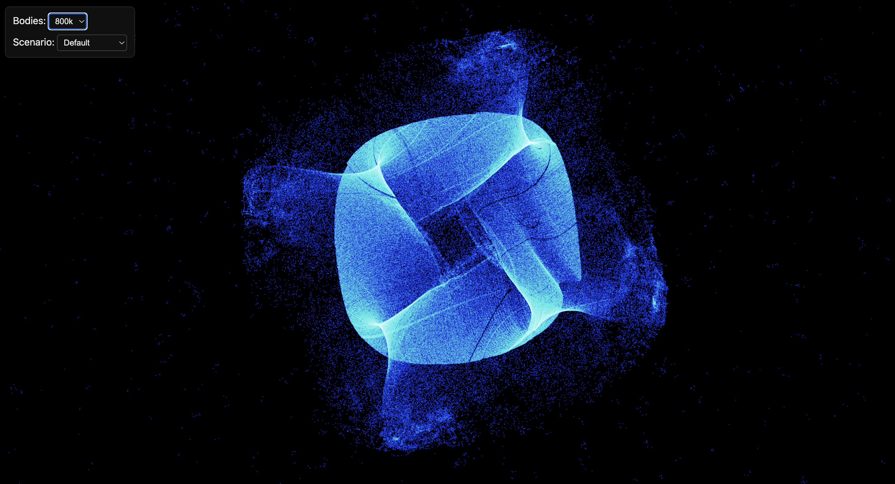
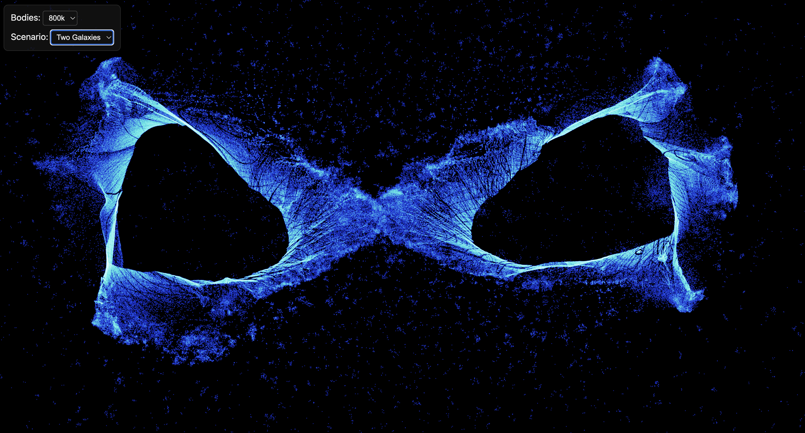

# webgpu-nbody-sim
A fast and light-weight n-body sim built using WebGPU compute shaders.

[View the live in-browser demo here!](https://elliottf05.github.io/webgpu-nbody-sim/)

## Features
- Computation runs entirely on the GPU in parallel using WebGPU compute shaders.
- Supports up to 800k graviational bodies interacting in real-time.
- Linear bounding-volume hierarchy (LBVH) to accelerate runtime from O(n^2) to O(nlogn) using the Barnes-Hut algorithm.
- Tone-mapping shader to aesthetically represent density without over-exposure.
- Easy pan and zoom interactions.
- Ability to select number of bodies and scenario (more to come soon?).
